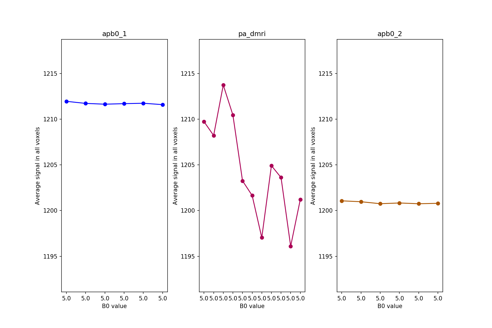
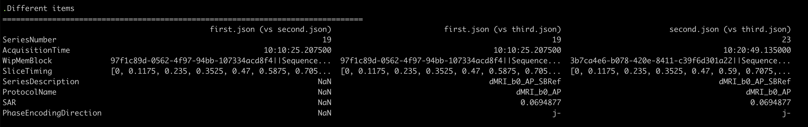
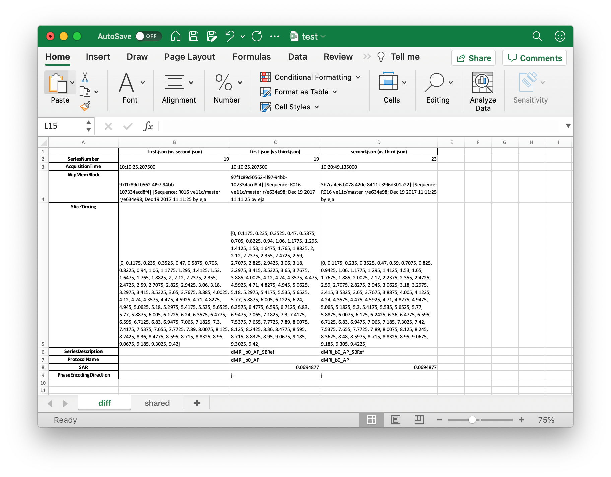

# phantom_check

Script used to check dicom header details in the phantom & human pilot MRI data.


## Contents

1. Installation
2. Usage
3. Functions
   1. `phantom_figure.py`
   2. `dicom_header_comparison.py`
   3. `dwi_extra_comparison.py`
   4. `extract_given_field_from_dicom.py`
   5. `summarize_mriqc_measures.py`
4. Examples


## 1. Installation


### 1. Requirements

- `dcm2niix` (>= version xxx)

- `python3`


#### Install dcm2niix and add to $PATH

```
export PATH=${PATH}:/PATH/TO/DCM2NIIX   # add to ~/.bashrc
```


### 2. Installation

#### Install using pip (not supported yet)

```
pip install phantom_check
```


#### Install in degugging mode

```
git clone https://github.com/AMP-SCZ/phantom_check
cd phantom_check
pip install -r requirements.txt

# python environment settings
export PYTHONPATH=${PYTHONPATH}:~/phantom_check

# path settings
export PATH=${PATH}:~/phantom_check/scripts
```


## 2. Usage


Dicom files -> extract unique dicom files representing each series -> inter & intra consistency check

Conversion to dicom to BIDS


## 3. Functions

### 1. `dicom_to_dpacc_bids.py`

This function is for U24 phantom and human scan dicoms. It first arranges dicoms into a structured
directory, before running `heudiconv` with U24 settings, making a BIDS structured nifti outputs.
Subject name and session name have to be specified to put them in the correct BIDS structure.


Below is the example command.

```sh
bsub -q normal -n 2 -e bsub.err -o bsub.out -J ${site} \
    python /data/predict/phantom_data/kcho/devel_soft/phantom_check/scripts/dicom_to_dpacc_bids.py \
        --input_dir /data/predict/phantom_data/kcho/tmp/PHANTOM_20211022 \
        --subject_name ProNET_Oct \
        --session_name phantom \
        --output_dir prac \
        --standard_dir /data/predict/phantom_data/phantom_data_BIDS/sub-ProNETUCLA/ses-humanpilot \
        --skyra
```


### 2. `phantom_figure.py`: Summarize signal as a figure

This function plots average of signals from each volume, for different set of dicom or nifti files. It expects a list of data sources, where the average signal for all voxels will be used to create a figure. Extra options are available for b0 signal extraction for dMRI scans.


#### Different options for the `phantom_figure.py`

- `--mode`
  - choose either `--mode dmri` or  `--mode general_4d`.
  - providing `--mode dmri` option will make the script to
    -  look for `*.bval` files in the given directories, with the same prefix as the nifti or dicom source. 
    - use `--b0thr` to limit the summary to volumes under a given bvalue.
- `--dicom_dirs <PATHS>`, `--nifti_prefixes <PATHS>` or `--nifti_dirs <PATHS>`
  - Use one of three options to specify the data source.
  - you can provide more than one data point separated with a space
    - eg) `--nifti_prefixes dti_AP/dti_AP dti_PA/dti_PA'`
  - if `--dicom_dirs` is provided
    - `dcm2niix` will be used to convert the dicoms into nifti in a temporary directory, which will be removed after loading the data from the nifti files.
    - provide `--store_nifti` to save the `dcm2niix` outputs.
    - names given to the `--names` will be used as the prefix in the `dcm2niix`, which will create directories under the current directory with the prefix.
- `--names <NAMES>`
  - A list of space separated names, in the same order as the order of source files. It is used as the labels in each figure, as well as the prefix for the nifti output.
  - if not given, the prefixes of the data sources will be used as the names.
- `--fig_num_in_row`
  - provide the number of columns in the figure.
- `--wide_fig`
  - an option to be used when a horizontal figure would better fit the visualization purpose
- `--out_image`
  - name of the output summary image to be saved.


#### Examples


```
# to print help message
./phantom_figure.py -h

# summaryize b0 from the dicom directories
./phantom_figure.py \
    --mode dmri \
    --dicom_dirs \
        ProNET_UCLA/dMRI_b0_AP_20 \
        ProNET_UCLA/dMRI_dir176_PA_22 \
        ProNET_UCLA/dMRI_b0_AP_24 \
    --names \
        apb0_1 pa_dmri apb0_2 \
    --store_nifti \
    --out_image new_test_dmri.png


# summaryize non-dMRI data
./phantom_figure.py \
    --mode fMRI \
    --dicom_dirs \
        ProNET_UCLA/fMRI_AP_1 \
        ProNET_UCLA/fMRI_AP_2 \
        ProNET_UCLA/fMRI_PA_1 \
    --names \
       fMRI_AP_1 fMRI_AP_2 fMRI_PA_1 \
    --out_image new_test_fmri.png


# run summary on nifti directories
./phantom_figure.py \
    --mode dmri \
    --nifti_dirs apb0_1 pa_dmri apb0_2 \
    --names apb0_1 pa_dmri apb0_2 \
    --b0thr 5000 \
    --out_image new_test_nifti_dir_thr5000.png


phantom_figure.py \
    --mode dmri \
    --dicom_dirs \
        ProNET_UCLA/dMRI_b0_AP_20 \
        ProNET_UCLA/dMRI_dir176_PA_22 \
        ProNET_UCLA/dMRI_b0_AP_24 \
    --names \
        apb0_1 pa_dmri apb0_2 \
    --b0thr 50 \
    --store_nifti \
    --out_image b0_summary.png
```





### 3. `dicom_header_comparison.py`: Compare json files

 `dicom_header_comparison.py` uses the BIDS SIDCAR json file created from the `dcm2niix` to compare common and unique fields in across different json files.


#### Options in `dicom_header_comparison.py`

-  `--dicom_dirs <PATHS>`, `--nifti_prefixes <PATHS>` or `--nifti_dirs <PATHS>` 
  - Use one of three options to specify the data source.
  - you can provide more than one data point separated with a space
    - eg) `--nifti_prefixes dti_AP/dti_AP dti_PA/dti_PA'`
  - if `--dicom_dirs` is provided
    - `dcm2niix` will be used to convert the dicoms into nifti in a temporary directory, which will be removed after loading the data from the nifti files.
    - provide `--store_nifti` to save the `dcm2niix` outputs.
    - names given to the `--names <NAMES>` will be used as the prefix in the `dcm2niix`, which will create directories under the current directory with the prefix.
- `--field_specify <FIELD_NAME>`: Provide a field name to limit the comparison only to the `FIELD_NAME`.
- `--print_diff`: print the differences between each json source compared to each other, on screen.
- `--print_shared`: print common items between each json source compared to each other, on screen.
- `--save_excel </EXCEL/OUTPUT.xlsx>`: path to save the differences.


#### Examples

```
dicom_header_comparison.py \
    --json_files \
        apb0_1/apb0_1.json \
        pa_dmri/pa_dmri.json \
        apb0_2/apb0_2.json \
    --print_diff \
    --save_excel test.xlsx
```

 
 


```
# to print help message
./dicom_header_comparison.py -h

# summaryize three json files and print the comparison table
./dicom_header_comparison.py \
    --json_files \
        dMRI_b0_AP_20.json \
        dMRI_dir176_PA_22.json \
        dMRI_b0_AP_24.json \
    --print_diff \
    --print_shared


# summaryize b0 from the dicom directories
./dicom_header_comparison.py \
    --json_files \
        dMRI_b0_AP_20.json \
        dMRI_dir176_PA_22.json \
        dMRI_b0_AP_24.json \
    --save_excel json_summary.xlsx
    
# compare ShimSetting field between json files
dicom_header_comparison.py \
    --json_files \
        DistortionMap_AP.json \
        dMRI_following_DM.json \
        fMRI_following_DM.json \
    --field_specify ShimSetting \
    --print_diff \
    --print_shared
```


### 4. `dwi_extra_comparison.py`: Compare bvalues

 `dwi_extra_comparison.py` can be used to compare different bvalues.


#### Example

```
dwi_extra_comparison.py --bval_files first.bval second.bval
```


```
# output
Comparing bvals
- first.bval
- second.bval
        The 2 bval arrays are exactly the same.
                shells: [   0.  200.  500. 1000. 2000. 3000.] (6 shells)
                volumes in each shell: [11  6 10 50 50 50] (177 directions)
```


### 5. `extract_given_field_from_dicom.py`: extract specific information from a dicom file

#### Examples

```
# print on the screen
extract_given_field_from_dicom.py \
    --dicom_file example.dcm \
    --group_number 0029 \
    --element_number 1020
    
# save as a text file
extract_given_field_from_dicom.py \
    --dicom_file example.dcm \
    --group_number 0029 \
    --element_number 1020 \
    --output_file test.txt
```


### 6. `summarize_mriqc_measures.py`:  Summarize mriqc outputs

Running `MRIQC` creates a json for a subject included in the list. This json file could be used to extract qualitative measures from the QC.


#### Example
```
summairze_mriqc_measures.py \
    --mri_qc_jsons sub-01_T1w.json sub-02_T1w.json \
    --opendata_csv mriqception/demo_api/T1w_demo.csv \
    --out_image t1w_mriqc.png
```


## 4. Other examples

- [Convert and summarize](docs/example_convert_figure.sh)
- [field_specify example](docs/example_script_same_session.sh)
