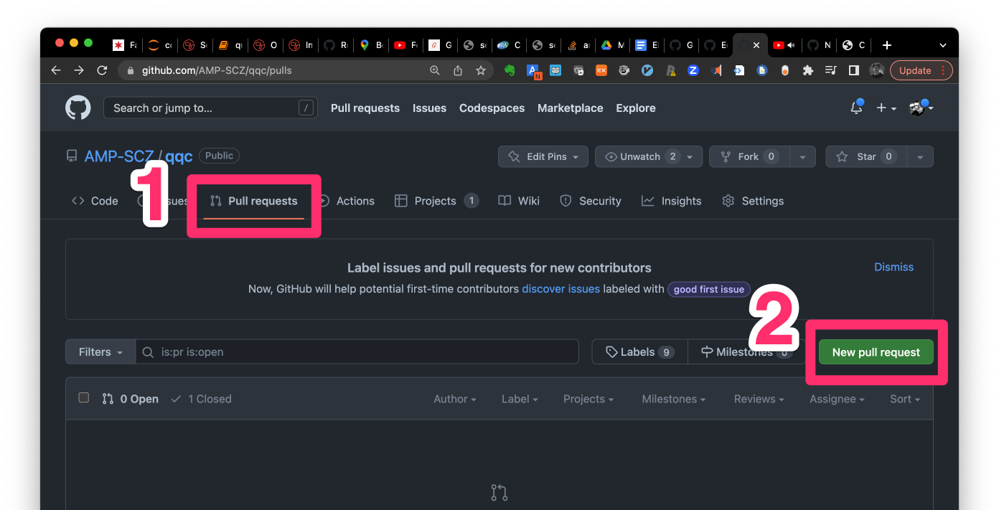
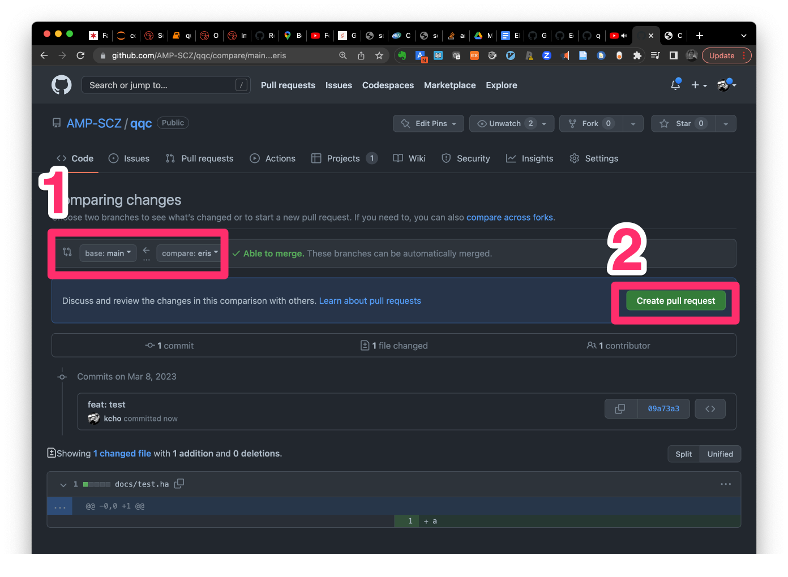

# A short summary of steps required to collaborate with others on Github


## Contents

- [Reminder](#reminder)
- [Branches Tutorial](#brainches-tutorial)
- [Git basics](#git-basics)


## Reminder

For QQC development, we will use `pnldev` branch as the core branch to merge any of within PNL updates (new branches will be merged into `pnldev` branch). Before making any edits to QQC, please create a new branch from the `pnldev` branch and create a push request (PR) back to merge the changes back to `pnldev` for code review.

```sh
git clone https://github.com/AMP-SCZ/qqc
cd qqc
git checkout pnldev
git pull
git checkout pnldev_nick_new_api
... # edit code / add updates
git push --set-upstream origin pnldev_nick_new_api
```
Then create a push request (PR), following step 6-11 of [How to add a new function](#1-how-to-add-a-new-function) below.


## Branches tutorial

Think of git branch as tree branches. Each branch has its head branch.

### Simple example

```sh
--------X--------Y---------Z
        │
        └--------A---------B
```

- Y evolves from X
- Z evolves from Y
- A evolves from X
- B evolves from A


### QQC example 

1. When we need to add different functions to QQC, we branch out from `pnldev`, which is the branch to have all of the most recent changes.

```sh
main--------pnldev-----nick_new_func
              │
              └--------kcho_new_func

# git checkout pnldev
# git checkout -b nick_new_func
```

- Nick adds a function to `pnldev` branch
- Kevin adds a function to `pnldev` branch


2. Once the edits are tested, push request (PR) to `pnldev` needs to be created to ask other members for the code review

```sh
main--------pnldev<----nick_new_func
              │
              └<-------kcho_new_func
```

- Nick creates PR from `nick_new_func` to `pnldev` and request code review.
- Kevin create PR from `kcho_new_fucn` to `pnldev` and request code review.


3. Others find issues with the PR and leave comments. Sometimes directly suggest changes.

```sh
main--------pnldev-----nick_new_func-----owen_fix_nick_new_func
              │
              └--------kcho_new_func
                              │
                              └--------nick_edit_kcho_new_func

# git pull
# git checkout nick_new_func
# git checkout owen_fix_nick_new_func
```

- Owen finds a few errors in what Nick added in the `nick_new_func`. Owen branches out from `nick_new_func` to `owen_fix_nick_new_func` and
edit the code. Once Owen finished editing, Owen creates PR to `nick_new_func` branch from `owne_fix_nick_new_func`, so Nick can review and
accept the changes to `nick_new_func` branch.

- Nick further develops the logics that kevin added in the `kcho_new_func`, by branching out from `kcho_new_func` to `nick_edit_kcho_new_func`.
Nick creates PR from `nick_edit_kcho_new_func` to `kcho_new_func`, so Kevin can review and approve the suggested changes (into `kcho_new_func`


4. Suggested changes are merged into each head branch

```sh
                                    
main--------pnldev-----nick_new_func
              │
              └--------kcho_new_func
```

5. Once the review process is done, `nick_new_func` gets merged into `pnldev`

```sh
                                    
                  merge
main--------pnldev<----nick_new_func
              │
              └--------kcho_new_func
```

```sh
main--------pnldev*
              │
              └--------kcho_new_func
```

6. Notice the `pnldev` branch, that `kcho_new_func` branched out from, is updated. So before `kcho_new_func` can get merged into `pnldev`,
`kcho_new_func` branch needs to have all the updates that `pnldev` now has (from `nick_new_func`).

```sh
                                    
main--------pnldev*
              │
              └------->kcho_new_func
                 merge
# git checkout pnldev
# git pull
# git checkout kcho_new_func
# git merge pnldev
```

6. `kcho_new_func` branch now has all edits that `nick_new_func` added to `pnldev`

```sh
main--------pnldev*
              │
              └--------kcho_new_func*
```

7. `kcho_new_func` gets merged into `pnldev` through the PR.

```sh
main--------pnldev*
```


1. How to pull repository from github
```sh
cd /go/to/any/directory
git clone https://github.com/AMP-SCZ/qqc
ls qqc
```


```sh
cd qqc
git branch  # see local branches
git branch -a  # see all branches including branches on github
```


## Git basics

1. [How to add a new function](#1-how-to-add-a-new-function)
2. [How to make changes to another person's branch](#2-how-to-make-changes-to-another-persons-branch)
3. [How to suggest changes to another person's branch](#3-how-to-suggest-changes-to-another-persons-branch)


## 1. How to add a new function

1. Pull the most recent version of the master branch

```sh
mkdir ~/tmp
cd tmp
git clone https://github.com/AMP-SCZ/qqc
cd qqc
```


2. Branch out to a new branch

```sh
git checkout -b new_function_kcho
```

3. Edit the code

4. Select the files updated with `git add` and commit changes

```sh
git add new_code.py  # if you edited the new_code.py
git commit -m "feat: new a_plus_one function is added"
```

5. Push to github

```sh
git push --set-upstream origin new_function_kcho
```

6. Create push request




7. Request review and get comments


8. Work on the comments (Edit the code following the suggestions)
```sh
# pull if anyone pushed changes to the branch
git pull
```

Edit the code then,
```sh
git add new_code.py
git commit -m "fix: removed unnecessary loop"
git push
```

9. Once the review process is completed, pull the most recent changes from the branch that you're trying to merge into. (just in case others have changed the `master` branch)

```sh
git checkout master
git pull
git checkout new_function_kcho
git merge master
git push
```

10. Merge to a branch


11. Delete the branch


## 2. How to make changes to another person's branch

1. Checkout to another person's branch and pull the most recent changes.

```sh
git checkout another_branch
git pull
```

2.  Edit the code

3. Add and Commit

```sh
git add new_code.py
git commit -m "feat: new a_plus_one function is added"
```

4. Push to github

```sh
git push
```


## 3. How to suggest changes to another person's branch

1. Checkout to another person's branch and pull the most recent changes.

```sh
git pull
git checkout another_branch
git pull
```


2. Branch out

```sh
git checkout -b another_branch_suggestion
```

3.  Edit the code

4. Add and Commit

```sh
git add new_code.py
git commit -m "feat: new a_plus_one function is added"
```

5. Push to github

```sh
git push
```

6. Create push request
11. Repeat 6 to 9 of item 1 at the top until no more concerns
12. Pull the most change from the branch that you're trying to merge into. (just in case others have changed the `master` branch)

```sh
git checkout another_branch
git pull
git checkout another_branch_suggestion
git merge another_branch
```

14. Merge to a branch
15. Delete the branch
