===================
Quick Quality Check
===================

.. _qqc_outputs:

-------------------
List of QQC outputs
-------------------

.. _qqc_to_standard:

Comparison to the standard BIDS session given by user
-----------------------------------------------------
- ``series_count.csv``: This shows the comparison of unique series number 
  compared to the standard BIDS session. Look for any extra or missing series.

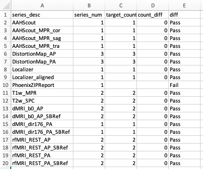

- ``json_comparison_log.xlsx``: compare input dcm2niix sidecar jsons to
  json in tempalte BIDS data.

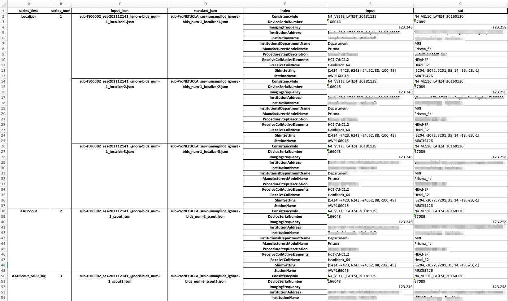

- ``json_comparison_log.txt``: same as above in a text format.

- ``volume_slice_number_comparison_log.csv``: This table shows the shape of
  each nifti array, and compares to matching nifti file under the given
  standard BIDS session. Look for any unmatched labels. (``False`` in the
  ``check`` column)

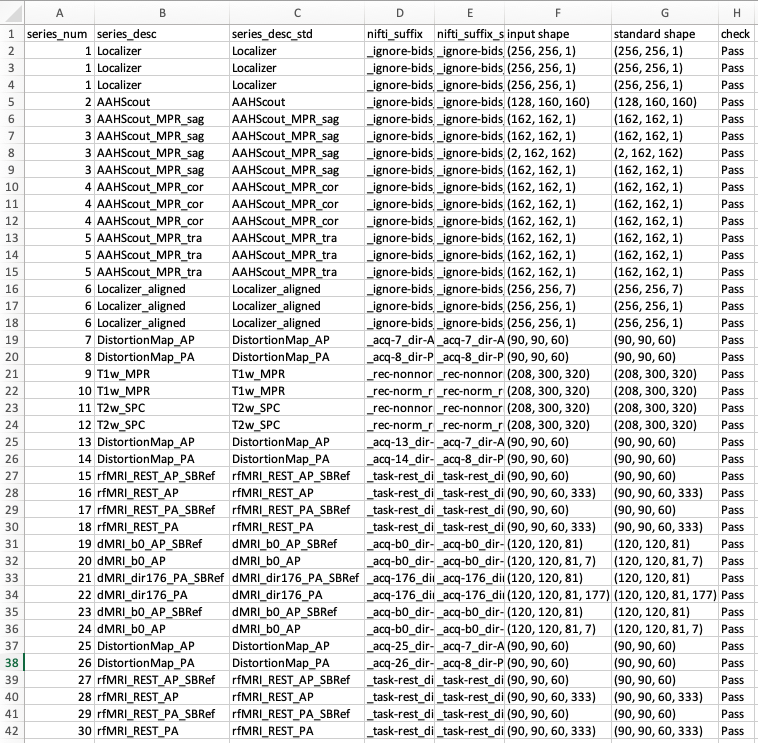
  
- ``scan_order.csv``: check order of series acquisitions against template 
  BIDS data.

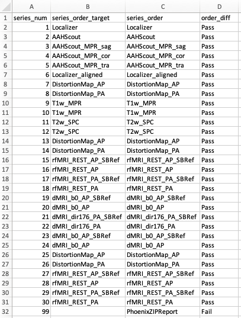

- ``bval_comparison_log.txt``: compare b-values and number of shells in DWI
  against template BIDS data.

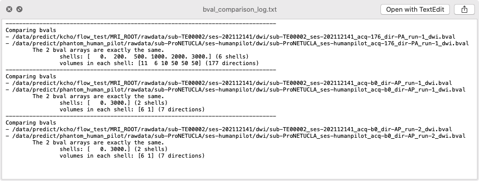

.. _qqc_same_session:

Consistency across the series in the same scan session
------------------------------------------------------

- ``within_phantom_qc.txt``: compare consistency across series in a same
  session

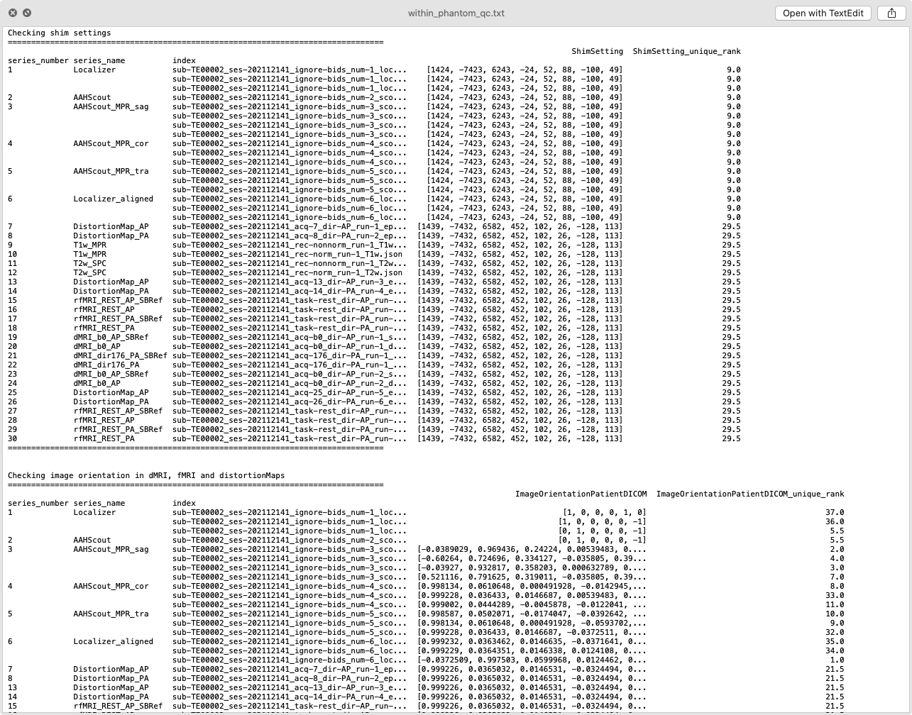

The same information is included in the tables below.

- ``json_check_image_orientation_in_anat.csv``
- ``json_check_image_orientation_in_dMRI_fMRI_and_distortionMaps.csv``
- ``json_check_shim_settings.csv``

- ``csa_headers.csv``: extract extra CSA header information for each series.

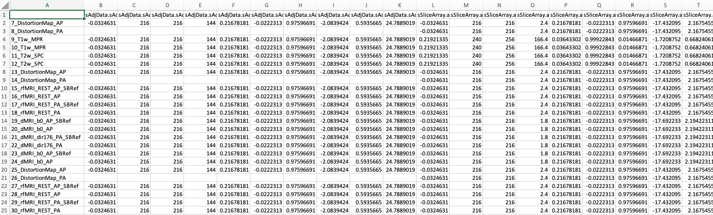

- ``summary_b0.png``

.. _qqc_signals:

Quick summary of signals in DWI and REST fMRI
---------------------------------------------

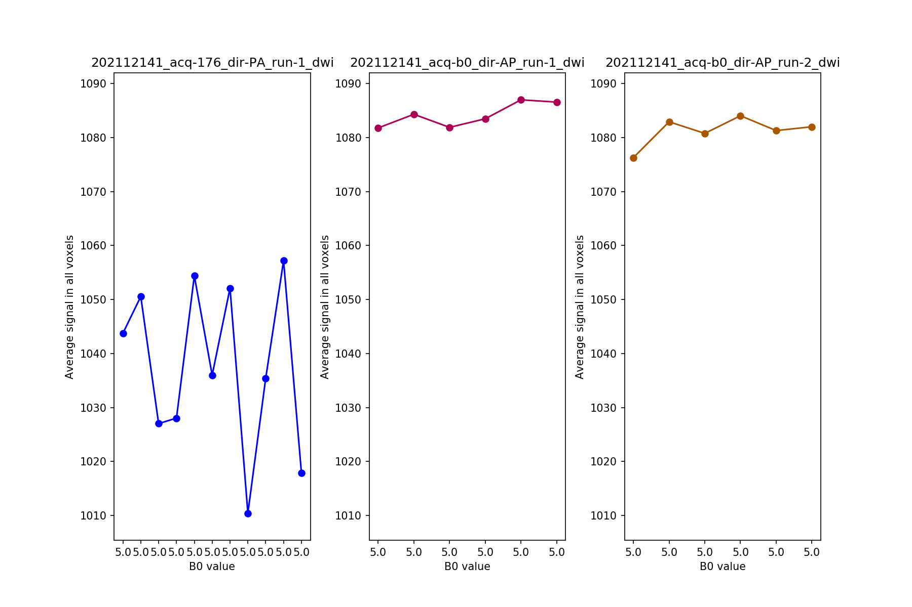

- ``summary_dwi.png``

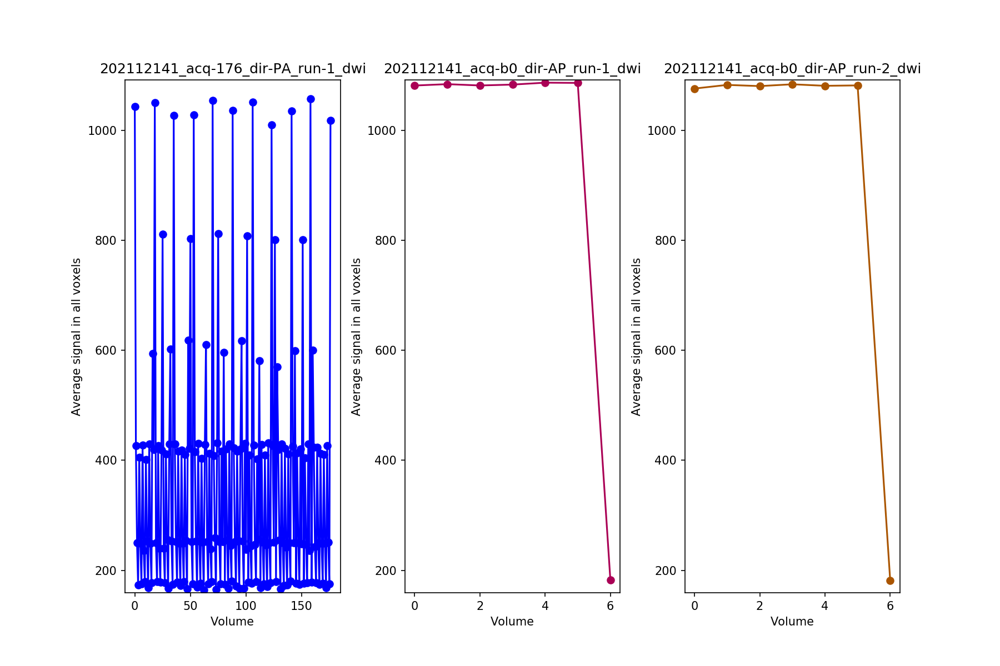

- ``summary_fmri.png``

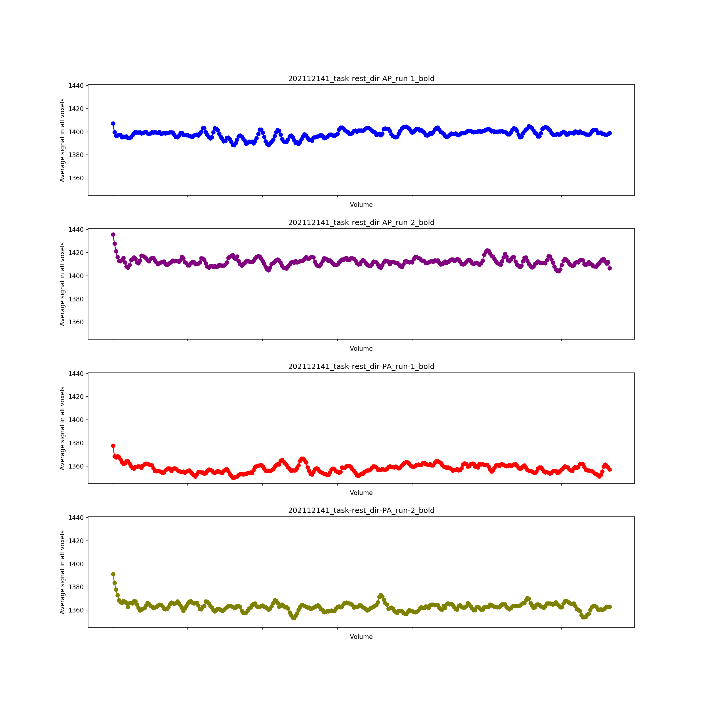

.. _qqc_snapshot:

Quick capture of all nifti files
--------------------------------

If a nifti file is 4D, only first volume is captured by default.

- ``sub-BW00001_ses-202107221_acq-176_dir-PA_run-1_dwi.png``
- ``sub-BW00001_ses-202107221_acq-176_dir-PA_run-1_sbref.png``
- ``sub-BW00001_ses-202107221_acq-b0_dir-AP_run-1_dwi.png``
- ``sub-BW00001_ses-202107221_acq-b0_dir-AP_run-1_sbref.png``
- ``sub-BW00001_ses-202107221_acq-b0_dir-AP_run-2_dwi.png``
- ``sub-BW00001_ses-202107221_acq-b0_dir-AP_run-2_sbref.png``
- ``sub-BW00001_ses-202107221_rec-nonnorm_run-1_T1w.png``
- ``sub-BW00001_ses-202107221_rec-nonnorm_run-1_T2w.png``
- ``sub-BW00001_ses-202107221_rec-norm_run-1_T1w.png``
- ``sub-BW00001_ses-202107221_rec-norm_run-1_T2w.png``

Examples

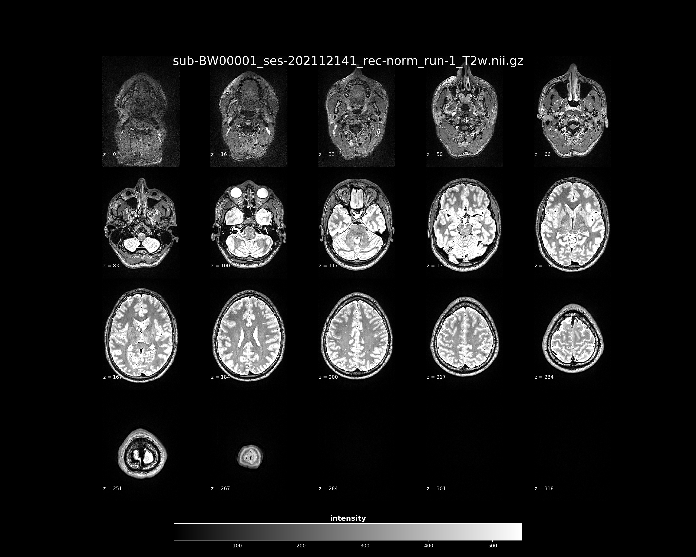

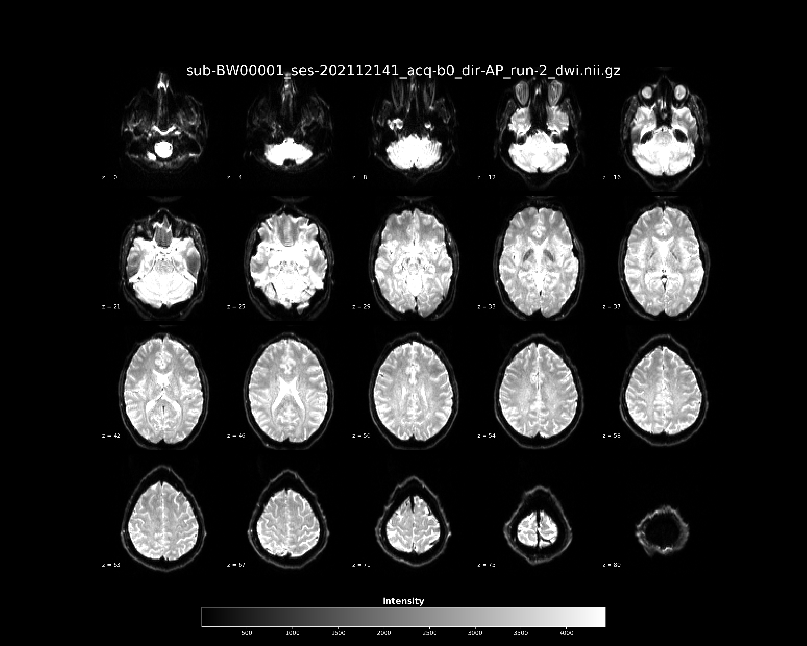

